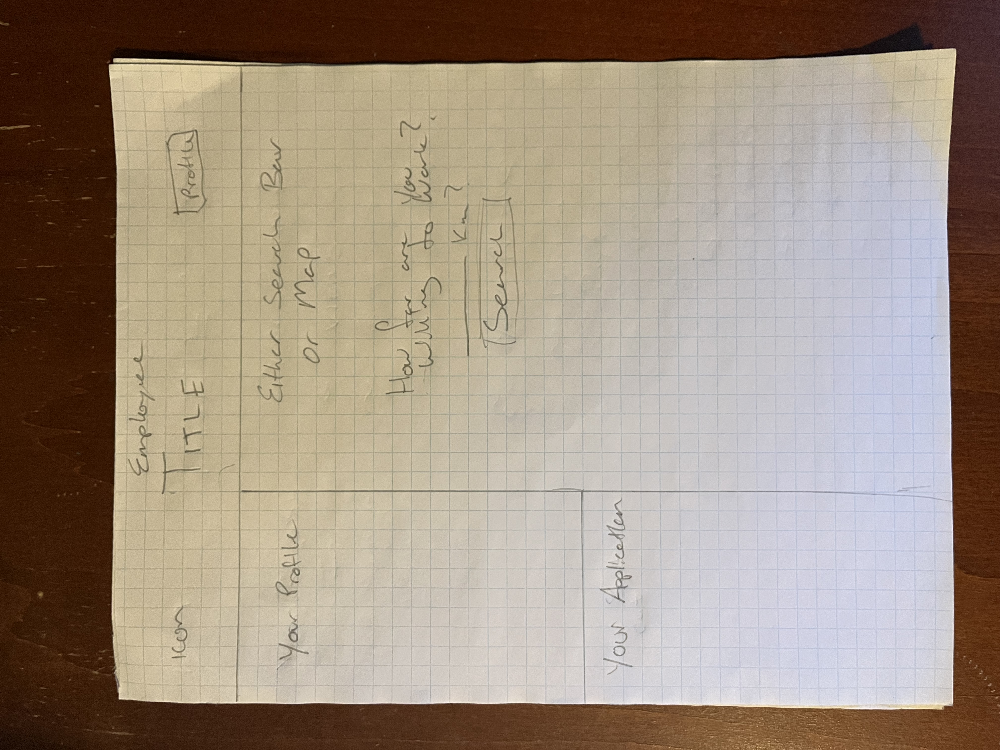
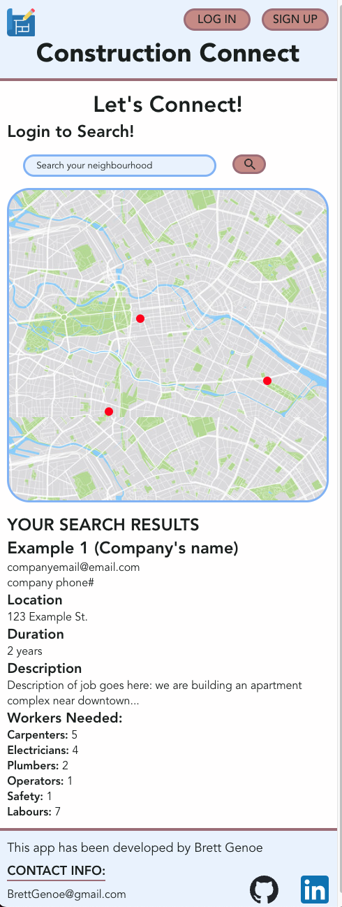

# Construction Connect

 please see backend at <a href="https://github.com/brettgenoe/brett-genoe-construction-connect-backend">brett-genoe-construction-connect-backend</a> 

## Overview

<i>What is your app? Brief description in a couple of sentences.</i>

My app is a platform for construction employers and employees to connect. Employers can create profiles and post jobs, allowing future employees to see and respond to the add. Future Employees can search jobs by location and qualifications, allowing a steamlined process for hiring.

### Problem

<i>Why is your app needed? Background information around any pain points or other reasons.
</i>

This stems from my experience in the construction industry, where I worked alongside my family. As both a laborer and later, a construction manager, it was often challenging to find labor in remote areas. I believe that much of this difficulty stems from accessibility issues. The average construction worker typically won't use LinkedIn for various reasons. However, finding jobs can also be tricky, as potential employees are often limited to platforms such as Kijiji, Indeed, and most prominently, word of mouth. By creating an easy-to-use system for navigating locations and identifying the required/acquired skills, I hope to benefit both employers and workers by simplifying the process of finding work and suitable employees.

### User Profile

<i>Who will use your app? How will they use it? Any special considerations that your app must take into account.
</i>

Primarily there will be two types of users/profiles. One for employees who are able to post jobs, and one for potential employees, who can get in contact with employers and see the potential listings.

### Features

<i>List the functionality that your app will include. These can be written as user stories or descriptions with related details. Do not describe _how_ these features are implemented, only _what_ needs to be implemented.</i>

The main features for an employers standpoint would be the ability to post jobs, including the location to be placed on a map. The employeers would be able to search, depending on location, and potentially update their resume online to send directly to employer. 

## Implementation

### Tech Stack

<i>List technologies that will be used in your app, including any libraries to save time or provide more functionality. Be sure to research any potential limitations.</i>

In this capstone, I will use: HTML, CSS, Sass, JavaScript, React, Node.js, Express, Axios, mySQL, GitHub. I'm sure I will use more and add as they come. 

### APIs

<i>List any external sources of data that will be used in your app.</i>

My main API will be a mapping API which I will get from the Google Maps API. I will use Mapbox as a backup

### Sitemap

<i>List the pages of your app with brief descriptions. You can show this visually, or write it out.</i>

There will be a entrance page, with login features, seperating employers to employees. There will be essentially two homepages, depending on which of the two types of profiles you fit under, or what might be better is a single homepage, with the post button what is only accessible as a employer. 

### Mockups

<i>List the pages of your app with brief descriptions. You can show this visually, or write it out.</i>

<h3><b>This is a example sketch of a mockup for an employer page and its functionality</b></h3>

 

<h3><b>This is a example sketch of a mockup for an employee page and its functionality</b></h3>

<h3><b>This is a example of a mockup on mobile view</b></h3>

### Data

<i>Describe your data and the relationships between them. You can show this visually using diagrams, or write it out. </i>

My Data has two sets, users/profile data, which shows name, email, passwords, type of client, etc. and job data, which would show location, length and how many workers they need. 

### Endpoints

<i>List endpoints that your server will implement, including HTTP methods, parameters, and example responses.</i>

The first endpoint would consist of whether they are an employer or employee. While browsing for jobs, once clicked would render a new endpoint to give details about said job. 

### Auth

<i>
Does your project include any login or user profile functionality? If so, describe how authentication/authorization will be implemented.</i>

The project should and will use login and user profile functionality, especially as it could hold important information. 

## Roadmap

<i>
Scope your project as a sprint. Break down the tasks that will need to be completed and map out timeframes for implementation. Think about what you can reasonably complete before the due date. The more detail you provide, the easier it will be to build.</i>

Please see attached <a href="./public/proposalAssets/ConstuctionConnect-Sprint1GanttChart-Nov13.pdf">Gantt Chart:</a>

<ul>
<li>
Step one - build frontend skeleton and a pseudo design so I can figure out the essential data needed. 1-2 days</li>
<li>
Step two - build backend skeleton, connect Google Map API into backend and frontend to make sure is functional. 1-2 days </li>
<li>
Step three - build data bases for users and jobs. 2 days </li>
<li>
Step four - create login page to update and add users. 2 days
</li>
<li>
Step five - create add job function. 2 days</li>
<li>
Step six * (to be determined if time is going well) - add user authentication to users. 2-3 days. </li>
<li>
Step seven - if all good, add styling, media queries, font, functionalities, etc. for remainder of last sprint. 3-4 days</li></ul>

(I'm starting on the 13th of November, which would give me essentially ~13-14 days of work.) 

## Nice-to-haves

<i>Your project will be marked based on what you committed to in the above document. Under nice-to-haves, you can list any additional features you may complete if you have extra time, or after finishing.</i>

Nice to haves will list in importance:
<ul>
<li>
User authentication </li>
<li> A search querie to be able to look for jobs from a certain distance </li>
<li> Uploading resume </li>
<li>A job scrapper from sites like Indeed and kijiji</li>
<li> More detailed profile pages to include website details, etc. </li>

