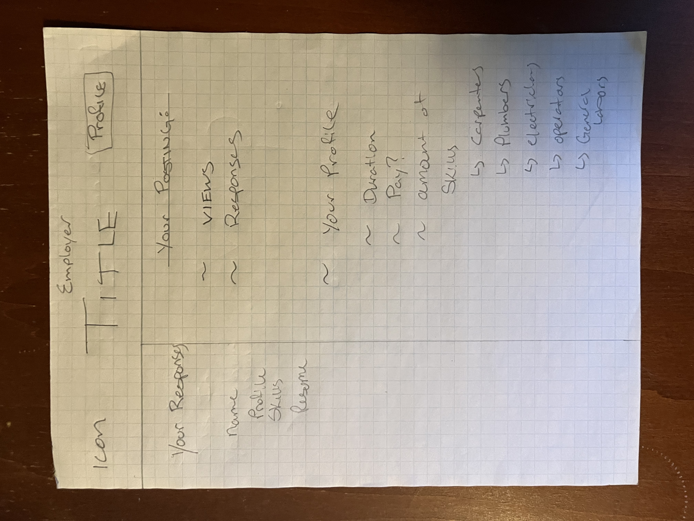

# Project Title
Construction Connect

## Overview
My app is a platform for construction employers and employees to connect, allowing a steamlined process for hiring. 

### Problem

This stems from my experience in the construction industry, where I worked alongside my family. As both a laborer and later, a construction manager, it was often challenging to find labor in remote areas. I believe that much of this difficulty stems from accessibility issues. The average construction worker typically won't use LinkedIn for various reasons. However, finding jobs can also be tricky, as potential employees are often limited to platforms such as Kijiji, Indeed, and most prominently, word of mouth. By creating an easy-to-use system for navigating locations and identifying the required/acquired skills, I hope to benefit both employers and workers by simplifying the process of finding work and suitable employees.

### User Profile

Primarily there will be two types of users/profiles. One for employees who are able to post jobs, and one for potential employees, who can get in contact with employers and see the potential listings. 

### Features

The main features for an employers standpoint would be the ability to post jobs, including the location to be placed on a map. The employeers would be able to search, depending on location, and potentially update their resume online to send directly to employer. 

## Implementation

### Tech Stack

In this capstone, I will use: HTML, CSS, Sass, JavaScript, React, Node.js, Express, Axios, mySQL, GitHub. I'm sure I will use more and add as they come. 

### APIs

My main API will be a mapping API which I will get from the Google Maps API. I will use Mapbox as a backup

### Sitemap

There will be a entrance page, with login features, seperating employers to employees. There will be essentially two homepages, depending on which of the two types of profiles you fit under. 

### Mockups

### Data

My Data has two sets, users/profile data, which shows name, email, passwords, type of client, etc. and job data, which would show location, length and how many workers they need. 

Describe your data and the relationships between them. You can show this visually using diagrams, or write it out. 

### Endpoints

The first endpoint would consist of whether they are an employer or employee. While browsing for jobs, once clicked would render a new endpoint to give details about said job. 

List endpoints that your server will implement, including HTTP methods, parameters, and example responses.

### Auth

The project should and will use login and user profile functionality, especially as it could hold important information. 

Does your project include any login or user profile functionality? If so, describe how authentication/authorization will be implemented.

## Roadmap
Please see attached Gantt Chart:

Step one - build frontend skeleton and a pseudo design so I can figure out the essential data needed. 1-2 days
Step two - build backend skeleton, connect Google Map API into backend and frontend to make sure is functional. 1-2 days
Step three - build data bases for users and jobs. 2 days 
Step four - create login page to update and add users. 2 days
Step five - create add job function. 2 days
Step six * (to be determined if time is going well) - add user authentication to users. 2-3 days. 
Step seven - if all good, add styling, media queries, font, functionalities, etc. for remainder of last sprint. 3-4 days

(I'm starting on the 13th of November, which would give me essentially ~13-14 days of work.)

Scope your project as a sprint. Break down the tasks that will need to be completed and map out timeframes for implementation. Think about what you can reasonably complete before the due date. The more detail you provide, the easier it will be to build.

## Nice-to-haves

Nice to haves will list in importance:
~ User authentication
~ a search querie to be able to look for jobs from a certain distance
~ uploading resume
~ more detailed profile pages to include website details, etc.  

Your project will be marked based on what you committed to in the above document. Under nice-to-haves, you can list any additional features you may complete if you have extra time, or after finishing.
